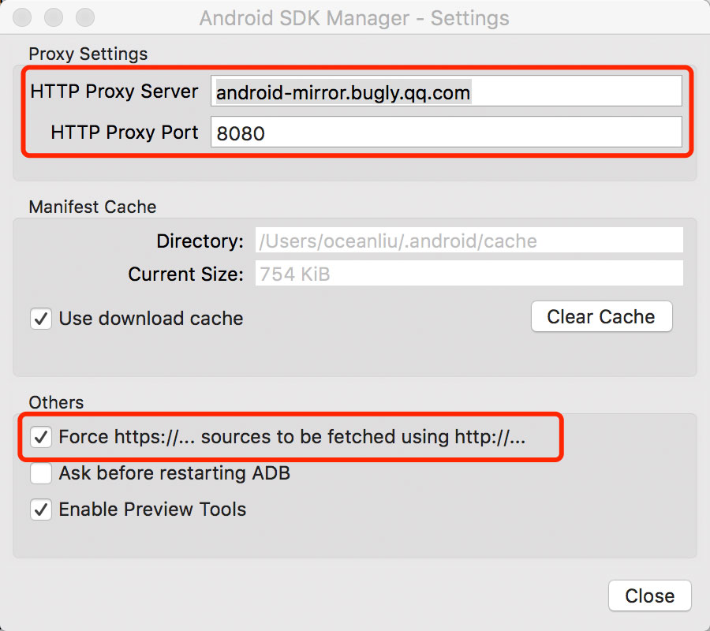

# 「React Native 入门」之在 macOS 上搭建Android 运行环境

前面一篇是说在 **macOS** 上搭建 **iOS** 运行环境，那么这篇就来说下在 **macOS** 上如何搭建 **Android** 运行环境。


## 安装 JAVA 

到官方网站去下载 [SDK](http://www.oracle.com/technetwork/java/javase/downloads/jdk8-downloads-2133151.html) ，根据提示自行安装。

安装完成后，打开 **Terminal（终端）** 输入 `java -version` ，验证是否已成功安装。


## 安装 Android SDK 

这里推荐使用 **Homebrew** 来安装管理，升级、删除都非常方便，另外在前面一篇已有提过了，这里不再多说了。


安装完成之后，把 **android sdk** 的路径`export ANDROID_HOME=/usr/local/opt/android-sdk`追加到** .bashrc** 或者 **.zshrc** 配置文件中去，具体是那个配置文件主要看你自己用的是什么终端。


## 修改 Android SDK 默认配置

1.打开 **Terminal（终端）**，输入 **android** 会打开 **Android SDK Manager** ，注意左上角。

2.修改 **proxy** 代理配置如下图




3.下载与安装相关依赖包


## 下载 Genymotion 模拟器

1.登录 [Genymotion](https://www.genymotion.com/) 官网

2.注册一个帐号并下载安装包

3.添加虚拟设备（手机）


4.运行项目

```
react-native run-android
```

效果如下：


辛苦你看到这里，恭喜你环境就已成功搭建完成了。

Have a nice day!


#### 参考资料

- [http://yijiebuyi.com/blog/21f40895e86f4f62bc29956a21a85215.html](http://yijiebuyi.com/blog/21f40895e86f4f62bc29956a21a85215.html)