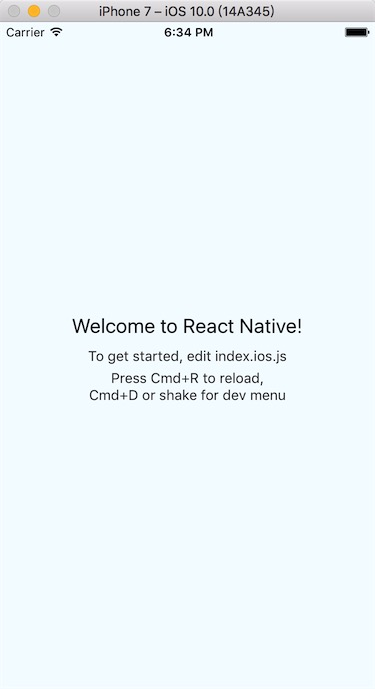
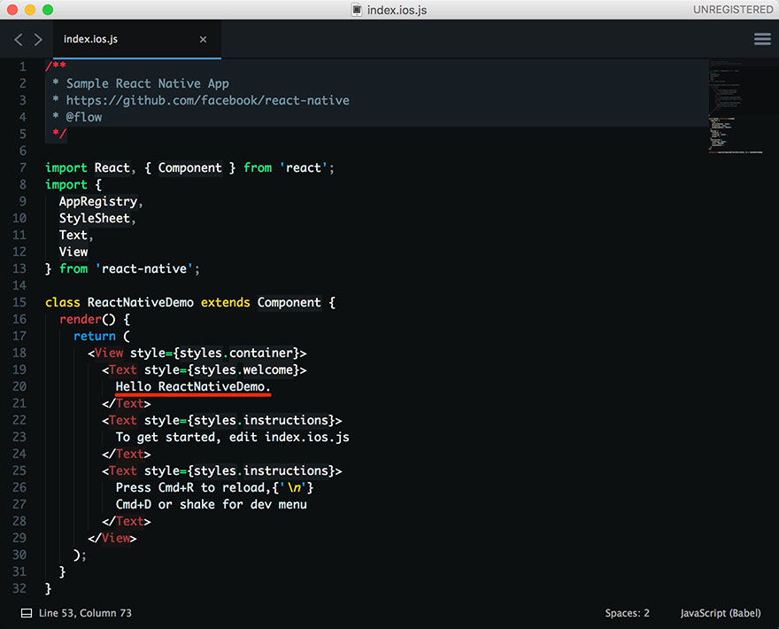
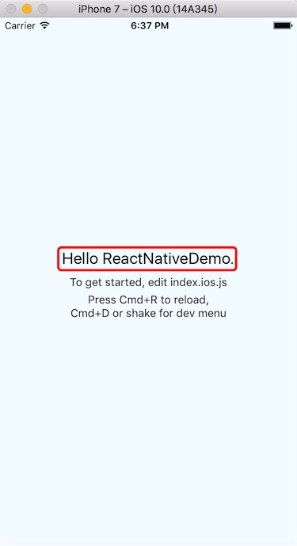
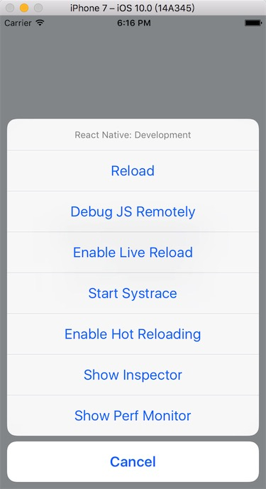

# 「React Native 入门」之在 macOS 上搭建 iOS 运行环境

在正式学习 **React Native** 之前，我们需要先把环境搭建好，下面我以 **macOS** 系统上为例，一步一步地介绍下 **React Native** 环境的搭建过程。


## 准备工作

1. **Node.js** 需要在 4.0 或更高以上的版本
2. **Xcode** 需要在 7.0 或更高以上的版本


另外在这里我还安装了 **Homebrew** ，方便于安装其他软件。

## 安装 Homebrew

```
/usr/bin/ruby -e "$(curl -fsSL https://raw.githubusercontent.com/Homebrew/install/master/install)"
```

关于 **Homebrew** 的更多介绍，详见[官网](http://brew.sh/)。

## 安装 Node.js

这里我们使用 **nvm** 来安装 **Node.js**，方便以后在不同的 **Node.js** 版本里来回的切换。以 **Node.js v6.6.0** 版本为例，具体安装步骤如下：

```
brew install nvm         // 安装 nvm
nvm install v6.6.0       // 安装 Node.js v6.6.0 版本
nvm use 6.6.0            // 用 nvm 切换 Node.js 的指定版本未 6.6.0
nvm alias default 6.6.0  // 修改 nvm 的 Node.js 版本的默认指向为 6.6.0
```


> 这里可能你会觉得很麻烦，还不如直接从 [Node.js](https://nodejs.org/en/) 官网里下载安装包来安装更方便呢？
>
> 这是个很好的问题。假设你本机已安装了 **Node.js v0.10.32** 版本，但是新项目却不兼容或者某些特性需要更高版本才能支持，而旧项目升级新版本需要付出很大的成本或者暂时不打算升级新版本，那么这时你会怎么做呢？如果你之前是用 **nvm** 来安装、管理 **Node.js** 的话，那么现在只需要简单的敲下命令切换就可以做到了，老项目继续用原来旧版本的，而新项目就采用最新的版本来开发，两者之间可以无缝自由的来回切换。


## 安装 React Native 和一些工具

### 1.安装 watchman

```
brew install watchman
```

[watchman](https://facebook.github.io/watchman/) 是用于监听文件是否发现变动或被修改的一个工具。


### 2.安装 flow

```
brew install flow
```

[flow](https://flowtype.org/) 是用于检测 JavaScript 静态类型是否编写正确。


### 3.安装 React Native Cli

```
npm install -g react-native-cli
```

`-g` 表示全局可用

`Cli` 全称是 **Command line**，即命令行工具

`react-native-cli` 用于 **React Native** 项目的创建、更新、运行、打包等任务。


## 创建 React Native 新项目

### 1.新建项目

初始化名为 `ReactNativeDemo` 的项目

```
react-native init ReactNativeDemo
```

大概需要等待 5 - 10 分钟左右，显示如下图

### 2.运行项目

首先，进入 `ReactNativeDemo` 目录

其次，输入 `react-native run-ios` 命令后，需要稍等下一会儿

最后，显示效果如下图



### 3.修改文件

在 `ReactNativeDemo` 目录下，找到 `index.ios.js`  文件，把`          Welcome to React Native!` 修改成 `Hello ReactNativeDemo.`



然后按下快捷键 `command+R` 刷新页面，预览效果如下图



### 4.开发者工具

按下快捷键 `Command + R` ，会弹出开发者工具菜单，如下图。



Debug、实时刷新、审查元素等更多的功能，留给大家慢慢的去研究、去尝试了。


#### 参考资料

- [http://facebook.github.io/react-native/docs/getting-started.html](http://facebook.github.io/react-native/docs/getting-started.html)