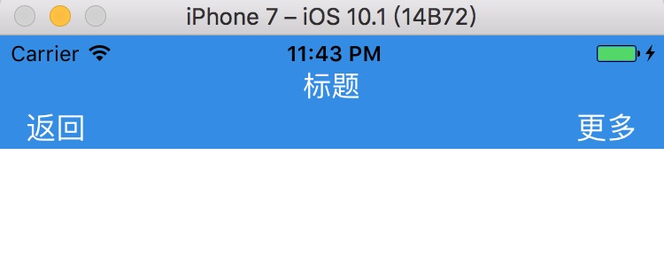
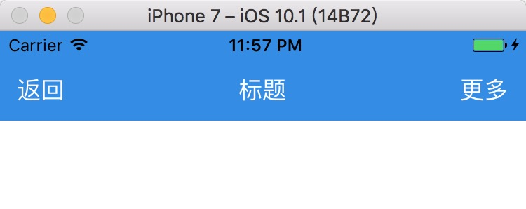
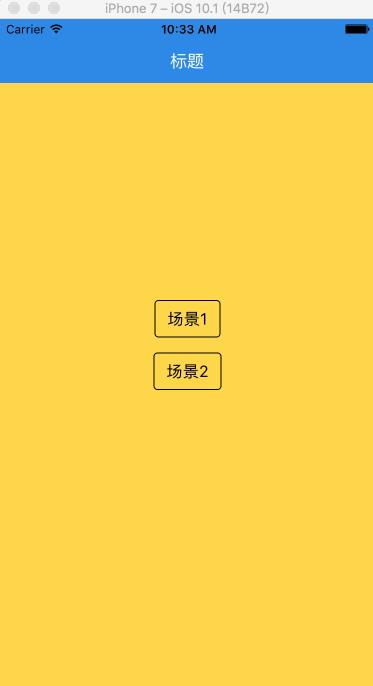
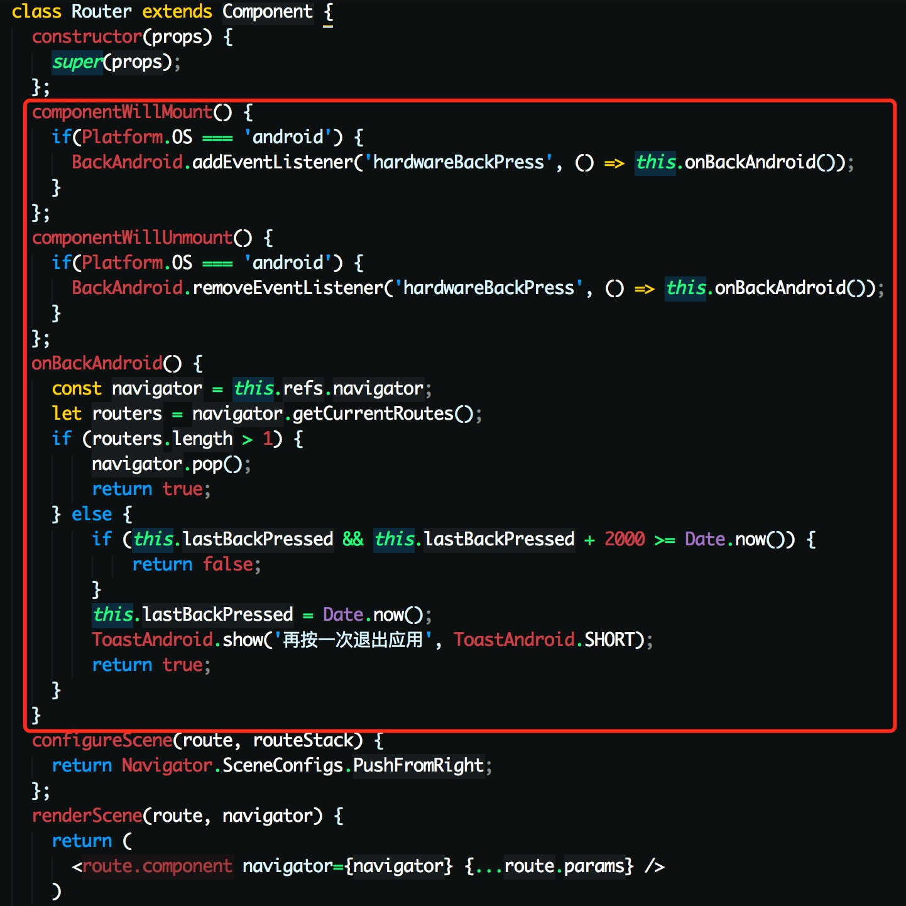

# React Native 之 Navigator

在 **React Native** 里，页面和页面之间的衔接与跳转，基本上是离开不 **Navigator** 组件

**Navigator** 的基本用法，这里就不一一详说了，大家可以到[官网](http://facebook.github.io/react-native/docs/navigator.html)上去看看。

下面来谈谈使用 **Navigator** 时，我遇到的一点小问题


### Navigator 布局

先来看下 **Navigator** 默认的布局效果如下图



存在几个问题

1.标题偏上没有居中

2.返回和更多按钮都偏下

一开始没有多想，只是简单用 **Margin**、**Padding** 来调下，在 **iOS** 上实现了水平垂直居中，但是在 **Android** 下还是无法水平垂直居中。

后面找了下 **Navigator** 的源码，路径是 `node_modules/react-native/Libraries/CustomComponents/Navigator/Navigator.js` 

**Navigator** 是根据 **Android** 、**iOS** 系统来区分，动态赋予不同的高度。

**Navigator** 默认的布局方式是绝对定位来的，根据 **Android** 、**iOS** 系统来区分，动态赋予不同的高度。

而根据官方的文档，我们可以知道 **LeftButton**、**RightButton**、 **Title** 这几个元素是独立的个体，互不影响，因此只需要给他们分别单独设置 **FlexBox**，然后把 **alignItems**、**justifyContent** 设置为居中，从而可以实现在 **Android** 和 **iOS** 系统上水平垂直居中显示（如下图）。



这里还有个地方需要注意的是后跟着的 **View** 需要用 **Padding** 或者 **Margin** 向上撑开导航栏的高度，否则默认会被挡在下面。


### Navigator 动画

**Navigator** 默认提供了 **12** 个种动画过渡效果，具体如下：

```
Navigator.SceneConfigs.PushFromRight (default)
Navigator.SceneConfigs.FloatFromRight
Navigator.SceneConfigs.FloatFromLeft
Navigator.SceneConfigs.FloatFromBottom
Navigator.SceneConfigs.FloatFromBottomAndroid
Navigator.SceneConfigs.FadeAndroid
Navigator.SceneConfigs.SwipeFromLeft
Navigator.SceneConfigs.HorizontalSwipeJump
Navigator.SceneConfigs.HorizontalSwipeJumpFromRight
Navigator.SceneConfigs.HorizontalSwipeJumpFromLeft
Navigator.SceneConfigs.VerticalUpSwipeJump
Navigator.SceneConfigs.VerticalDownSwipeJump
```

其中有 **HorizontalSwipeJump** 动画过渡效果，我是有点不理解，如下图



当我们还在主界面时竟然可以往左或往右拖动的，但是又无法切换到下一场景或者上一场景去？感觉上这是个 **BUG** 吧？还是我使用方式不对，欢迎来指正，印象中当在主界面时，往左应该是不能拖动才对的，往右应该是可以切换到下一场景去的。个人推荐是使用默认 **PushFromRight** 或者 **FloatFromBottom** 这两种动画过渡效果。目前 **React Native** 自带的 **Navigator** 转场动画真的是不！流！畅！呐，但可以通过 **InteractionManager** 简单的优化下 ，希望 **FB** 早点把原生版的转场动画给实现。


### Navigator 物理返回键

在 **Android** 系统下需要对物理返回键进行处理，官方提供了 **BackAndroid**  这个 **API**，通过它来监听 **hardwareBackPress** 这个事件，判断用户是否按下了返回键，然后我们再进行一系列处理（如下图）。



这里需要注意的是为了防止用户误点返回键操作，我们需要针对返回键连续操作添加时间判断，并在 **APP**  首页添加一次提示。


#### 参考资料

- [http://facebook.github.io/react-native/docs/navigator.html](http://facebook.github.io/react-native/docs/navigator.html)


- [http://reactnative.cn/post/480](http://reactnative.cn/post/480)
- [http://facebook.github.io/react-native/docs/backandroid.html](http://facebook.github.io/react-native/docs/backandroid.html)
- [https://github.com/facebook/react-native/tree/master/Examples/UIExplorer/js/NavigationExperimental](https://github.com/facebook/react-native/tree/master/Examples/UIExplorer/js/NavigationExperimental)