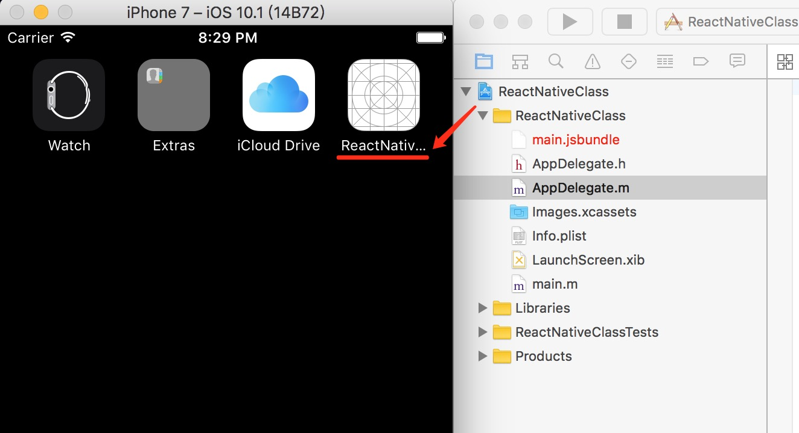
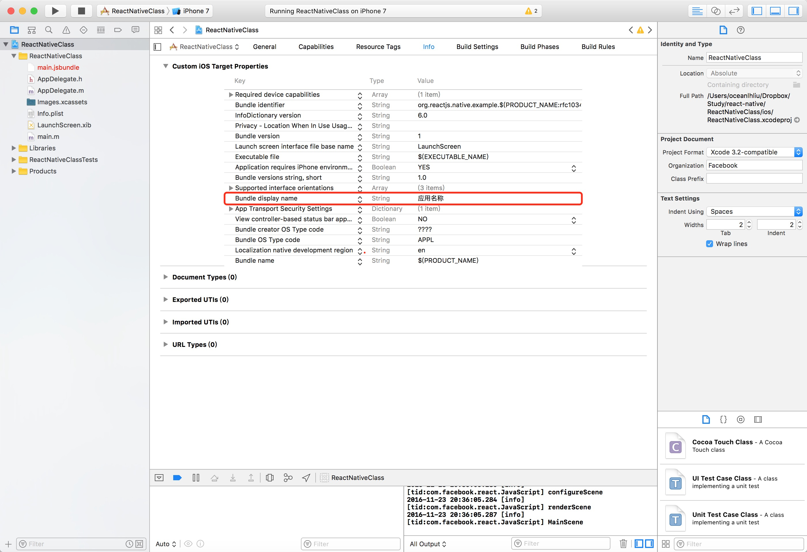
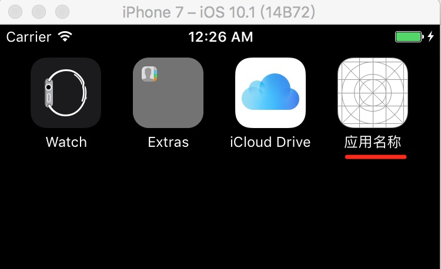
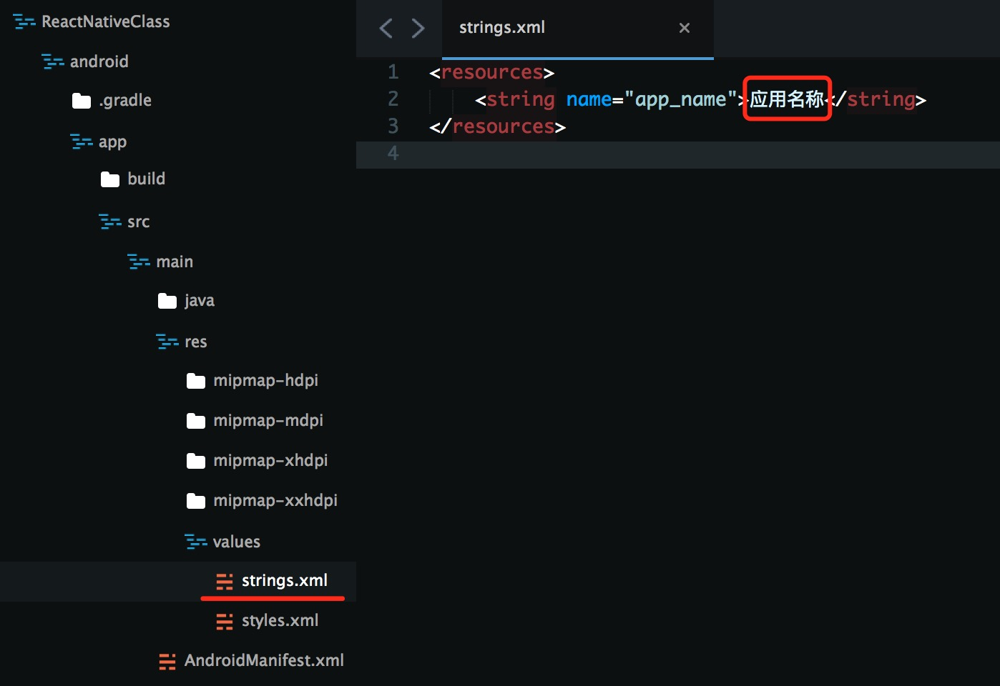
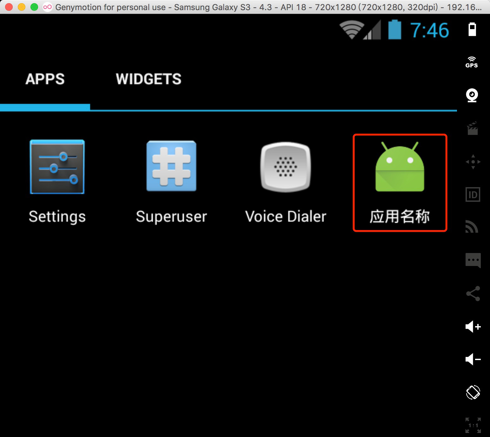

# React Native 之修改 APP 应用名称

最近用 **React Native** 写了个 **APP** ，拿给同事体验时，向我反馈了一个问题，关于 **APP** 名称是否能显示成中文名称？

我之前忙着开发，还真没留意过 **APP** 的名称，如下图

**APP** 的名称是一串英文字母，经过 [Google 大神](https://www.google.com.hk/) 的帮助下，得到信息是如果 **APP** 没有设置名称，则默认读取工程目录的名称，当作是 **APP** 的名称。如果设置了则读取开发者设置的名称，那么该如何设置呢？

### iOS

以 **iOS** 为例

1. 选中工程名称
2. 找到右侧菜单 `Info` 选项
3. 添加 `Bundle display name` 并把 `value` 设置成 "应用名称"
4. 最后重新再 **Run** 一次，即可看到最新的效果

**iOS APP** 修改完成后，名称显示如下图

### Android

**Android APP** 默认的名称显示也存在着同样的问题。

**Android APP** 应用名称修改需要先找到 `strings.xml` 文件，在 `工程名称/android/app/src/main/res/values/ ` 目录下，然后修改 `app_name` 的值为 "应用名称"。（如下图）

最后再重新 **Run** 一次，**Android APP** 修改完成后，名称显示如下图

#### 参考资料

- [http://www.jianshu.com/p/a3a70f0398c4](http://www.jianshu.com/p/a3a70f0398c4)
- [http://blog.stoneark.org/2016/04/19/Android-application-display-name/](http://blog.stoneark.org/2016/04/19/Android-application-display-name/)