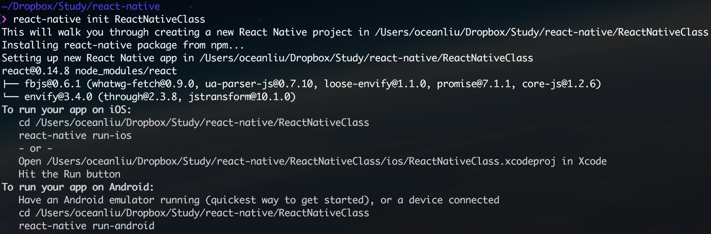

# 「React Native 入门」之项目结构

每当我们要开始一个新项目时，总是会先输入 `react-native init 项目名`，然后就会生成一堆文件和文件夹，那它们分别是做什么用的呢？


## 初始化新项目

首先，我们来初始化一个新项目 **ReactNativeClass**

`react-native init ReactNativeClass`

大概需要等待 **5 ~ 10** 分钟后显示如下图




## 项目结构

进入 `ReactNativeClass` 文件夹，然后通过 `tree` 命令来查看项目结构，如下:

```javascript
~/Dropbox/Study/react-native/ReactNativeClass   
❯ tree -L 1
.
├── android
├── index.android.js
├── index.ios.js
├── ios
├── node_modules
└── package.json
```

- `android` 文件夹里存放着打包 **Android APP** 时，所需要用到的相关工具及配置信息
- `ios` 文件夹存放着打包 **iOS APP** 时，所需要用到的相关工具及配置信息
- `index.android.js` 是 **Android** 应用程序的入口文件
- `index.ios.js` 是 **iOS** 应用程序的入口文件
- `node_modules` 存放 **package.json** 中所依并安装的模块
- `package.json`  保存着项目的基本信息及相关模块依赖


## 入口文件

下面我们来看看 `index.ios.js` 和 `index.android.js` 这两个文件，除了文件名不同外，文件里面的内容是一模一样的。


下面我们来拆分成几块一起了解下

#### 引入与声明

```
import React, {
  AppRegistry,
  Component,
  StyleSheet,
  Text,
  View
} from 'react-native';
```

这段代码可以理解为引入 **react native** 模块，并声明定义需要用到的组件。

这里直接使用了 **ES 6** 的语法，可能大家看着有点陌生。

下面我换种方式**（ES 5）**的

```
var React = require('react-native');
var AppRegistry = React.AppRegistry;
var Component = React.Component;
var StyleSheet = React.StyleSheet;
……
```

这种应该可以看得懂了吧，以前接触过 **Node.js** 的同学，估计更加清楚了。


#### Component 组件

```
class ReactNativeClass extends Component {
  render() {
    return (
      <View style={styles.container}>
        <Text style={styles.welcome}>
          Welcome to React Native!
        </Text>
        <Text style={styles.instructions}>
          To get started, edit index.android.js
        </Text>
        <Text style={styles.instructions}>
          Shake or press menu button for dev menu
        </Text>
      </View>
    );
  }
}
```

创建一个类（组件），继承 **Component** 。

**render** 方法就是用于渲染视图，**return** 后面的代码就是 **JSX** 语法。


#### 样式

```
const styles = StyleSheet.create({
  container: {
    flex: 1,
    justifyContent: 'center',
    alignItems: 'center',
    backgroundColor: '#F5FCFF',
  },
  welcome: {
    fontSize: 20,
    textAlign: 'center',
    margin: 10,
  },
  instructions: {
    textAlign: 'center',
    color: '#333333',
    marginBottom: 5,
  },
});
```

第一行表示定义了常量 `styles` , 具体数值不用写具体单位，默认单位是 **dp** 。支持 **FlexBox** 布局， 样式写法同 **WEB** 的 **CSS** 写法基本一样。


#### 注册应用入口

```
AppRegistry.registerComponent('ReactNativeClass', () => ReactNativeClass);
```

**AppRegistry** 是 **JS** 运行 **ReactNative** 程序的入口，**APP** 的根组件通过 ```AppReistry.registerComponent``` 来注册应用，然后原生系统通过调用 ```AppRegistry.runApplication``` 来加载 **bundle**，最后把应用运行起来。

**AppResgistry** 文件位于：```/node_modules/react-native/Libraries/AppRegistry/AppRegistry.js```

